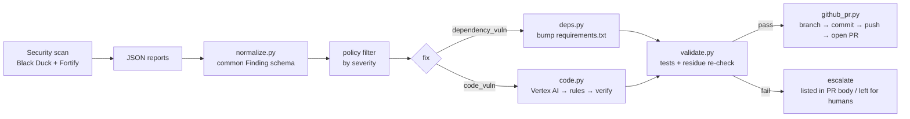

# How it works

The agent is a normal CLI (`python -m secfix`) that a CI job runs **after** the
security scan. There is no server and no background process — it does its work in
the pipeline and exits.

## Pipeline stages



### 1. Scan (your scanners)
Black Duck (SCA) and Fortify (SAST) run in the CI job and each write a JSON
report. In this demo we ship **simulated** reports under `scan_reports/` that
match the real API response shapes; the workflow shows exactly where the real
scanner commands go.

### 2. Normalize (`secfix/normalize.py`)
Adapters convert each scanner's JSON into one **common `Finding`** model, so the
rest of the agent is scanner-agnostic:

```python
Finding(scanner, type, severity, title, cve, category, file, line,
        component, current_version, fixed_version, ...)
```

- `normalize_blackduck` → `dependency_vuln` findings (component + fixed version).
- `normalize_fortify` → `code_vuln` findings (category + file + line).

Each finding has a stable **fingerprint** (`models.py`) used for de-duplication
and to correlate a PR back to its finding.

### 3. Policy filter (`secfix/cli.py`)
Only findings within `--severities` (default `critical,high`) are auto-fixed;
the rest are reported. Findings are processed worst-severity first.

### 4a. Dependency fixes — SCA (`secfix/fixers/deps.py`)
Parses `requirements.txt`, matches vulnerable components (name-normalized), and
rewrites each `name==version` to the scanner's fixed version. All dependency
bumps are grouped into **one** patch so the reviewer sees a single coherent
change. Lines that aren't affected are left byte-for-byte untouched.

### 4b. Code fixes — SAST (`secfix/fixers/code.py`)
For each `code_vuln`, the orchestrator tries providers in order and **verifies**
the result:

1. **Vertex AI (Gemini)** — `sast.py`, active only when
   `SECFIX_LLM_PROVIDER=vertex` and Google credentials are present. Produces a
   minimal patch for complex/unknown cases.
2. **Deterministic rules** — `rules.py`, trusted templates for known categories:

   | Category | Transformation |
   | --- | --- |
   | Weak Cryptographic Hash | `hashlib.md5/sha1(` → `hashlib.sha256(` |
   | Insecure Deserialization | `yaml.load(x, Loader=…)` → `yaml.safe_load(x)` |
   | Command Injection | `"a b " + v` + `shell=True` → arg list, no shell |
   | SQL Injection | `"… '" + v + "'"` → `"… ?", (v,)` parameterized |

Whichever provider is used, the patch must clear a **residue check** (the
vulnerable pattern is gone). If the AI patch doesn't verify, the agent falls back
to the rule engine; if nothing verifies, the finding is **escalated** (left for a
human and listed in the PR body). This is the key safety property: *no
unverified change ever reaches a PR.*

### 5. Validate (`secfix/validate.py`)
After patches are applied to the working tree:
- **Tests** — runs `--test-cmd`; if they fail, the agent aborts with a non-zero
  exit (no PR).
- **Presence/residue checks** — confirms each dependency now pins the fixed
  version and each code finding's pattern is gone.

Proven in the sample run: all 4 `sample_app` behaviour tests still pass *after*
the SQL/hash/yaml/command fixes — i.e. the fixes are behaviour-preserving.

### 6. Open the PR (`secfix/github_pr.py`)
With `--open-pr`, the agent creates a `secfix/auto-<timestamp>` branch, commits
as `secfix-bot`, pushes with `--force-with-lease`, and opens a PR via the GitHub
REST API using `GITHUB_TOKEN`. It attaches labels `security`, `automated`, and a
generated body listing every fix, its scanner/provider, and the validation log.
Uses only the standard library (`urllib`) — no third-party HTTP dependency.

## Exit codes

| Code | Meaning |
| --- | --- |
| 0 | Success (fixes applied / PR opened, or nothing actionable) |
| 2 | `--fail-on-findings` set and actionable findings existed |
| 3 | Validation failed (tests did not pass) — no PR |
| 4 | `--open-pr` requested but `GITHUB_TOKEN`/`--repo` missing |

## Testing the pipeline locally

One GitHub Actions workflow ships with the repo:

- **`.github/workflows/security-fix.yml`** — the real pipeline: scan → secfix
   fix PR when the scan reports vulnerabilities.

Because a GitHub runner isn't always available, `tests/test_pipeline_e2e.py`
reproduces the pipeline **mechanism** end to end, offline:

1. Builds a git repo from the demo files plus a bare `origin` remote.
2. Starts a **mock GitHub REST API** on localhost. The agent targets it because
   it honours the standard `GITHUB_API_URL` variable (set by GitHub Actions too).
3. Runs `python -m secfix --open-pr` with the same flags the workflow uses.
4. Asserts: fixes applied to the working tree, a `secfix/auto-*` branch pushed to
   `origin`, and a PR POSTed with the correct `base`/`head`, `Bearer` token, body,
   and `security`/`automated` labels.

```bash
py -m unittest tests.test_pipeline_e2e -v   # -> OK (branch pushed + PR created)
```

This exercises every moving part of the CI job except GitHub's cloud itself, so a
green run here strongly predicts a green run on a real runner.

## Avoiding pipeline loops

The workflow skips its own `secfix/*` branches
(`if: !startsWith(github.ref_name, 'secfix/')`) and only opens PRs on pushes to
`main`, so the bot's PR does not re-trigger another fix run.

## Why "propose, don't auto-merge"

The agent opens a PR and stops. A human (or your normal required-reviews +
green pipeline) merges. Dependency *patch* bumps are the safest candidates for
optional auto-merge; **all SAST code changes should be human-reviewed** because
they alter your logic — even when verified.
